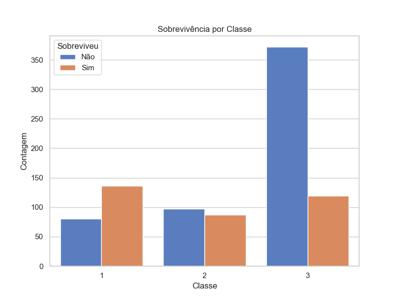

# Projeto de Análise dos Dados do Titanic

Este projeto utiliza o conjunto de dados do Titanic, amplamente conhecido e usado em competições de aprendizado de máquina e análises de dados. O objetivo é explorar os dados e identificar padrões relacionados à sobrevivência dos passageiros, utilizando técnicas de visualização e análise de dados.

## Objetivo

O objetivo deste projeto é realizar uma análise exploratória dos dados do Titanic, identificando como fatores como sexo, classe social, tarifa paga, porto de embarque e título de nobreza influenciaram as chances de sobrevivência.

## Arquivos

- `analisetitanic.ipynb`: Notebook Jupyter contendo o código da análise.
- `contagem_sobreviventes.png`: Gráfico de barras mostrando a contagem de sobreviventes.
- `Distribuição_Sexo_Sobrevivência.png`: Gráfico de barras segmentado por sexo e sobrevivência.
- `Distribuição_Classe_Sobrevivência.png`: Gráfico de barras segmentado por classe e sobrevivência.
- `Distribuição_Porto_Embarque_Sobrevivência.png`: Gráfico de barras segmentado por porto de embarque e sobrevivência.
- `Distribuição_Título_Sobrevivência.png`: Gráfico de barras segmentado por título e sobrevivência.
- `Fare_sobrevivencia.png`: Gráfico boxplot da distribuição de tarifas pagas pelos passageiros, comparando sobreviventes e não sobreviventes.
- `Histograma_idade_sobrevivência.png`: Histogramas comparando a idade dos passageiros que sobreviveram com os que não sobreviveram.
- `idade_sobrevivencia.png`: Boxplot mostrando a distribuição de idade entre os passageiros que sobreviveram e os que não sobreviveram.
- `Importância_das_Features.png`: Gráfico de barras mostrando a importância das variáveis (features) no modelo Random Forest.
- `matriz_confusao_rf.png`: Matriz de confusão do modelo Random Forest.
- `Matriz_correlação_Variáveis.png`: Matriz de correlação entre as variáveis utilizadas na análise.
- `porto_embarque.png`: Gráfico de barras mostrando a sobrevivência por porto de embarque.
- `Sobrevivência_classe.png`: Gráfico de barras mostrando a sobrevivência por classe social.
- `Sobrevivência_sexo.png`: Gráfico de barras mostrando a sobrevivência por sexo.
- `Sozinho_acompanhado.png`: Gráfico de barras mostrando a sobrevivência de pessoas que estavam sozinhas versus acompanhadas.

## Análises

### 1. Distribuição Geral de Sobreviventes

Este gráfico mostra que a maioria dos passageiros do Titanic não sobreviveu, com aproximadamente 550 mortos e 340 sobreviventes.

### 2. Distribuição de Sobrevivência por Sexo

Analisando a sobrevivência por sexo, podemos observar que a maior parte dos homens não sobreviveu, enquanto a maioria das mulheres sobreviveu. Isso reflete a política de "mulheres e crianças primeiro" adotada durante o desastre.

### 3. Distribuição de Sobrevivência por Classe

A distribuição por classe revela que os passageiros da primeira classe tiveram maiores chances de sobrevivência, enquanto os da terceira classe foram os que mais faleceram.

### 4. Distribuição de Sobrevivência por Porto de Embarque

O gráfico mostra que os passageiros que embarcaram no porto de Southampton (S) constituem a maior parte dos mortos. Em Cherbourg (C), houve uma proporção maior de sobreviventes.

### 5. Distribuição de Sobrevivência por Título

Os gráficos de título mostram que mulheres com os títulos de Miss e Mrs têm uma taxa de sobrevivência maior, enquanto a maioria dos homens com o título de Mr não sobreviveu.

### 6. Distribuição de Tarifa por Sobrevivência

A distribuição das tarifas pagas indica que os sobreviventes tenderam a pagar tarifas mais altas, indicando uma correlação entre a classe social e as chances de sobrevivência.

### 7. Distribuição de Idade por Sobrevivência

O boxplot acima mostra a distribuição de idade entre os passageiros que sobreviveram e os que não sobreviveram. Nota-se que há uma tendência para a sobrevivência de passageiros mais jovens, embora haja também uma faixa considerável de idosos sobreviventes.

### 8. Importância das Features no Modelo Random Forest

Este gráfico de barras mostra a importância das variáveis utilizadas no modelo Random Forest. As variáveis mais influentes para o modelo foram "Fare" (Tarifa) e "Age" (Idade).

### 9. Matriz de Confusão - Random Forest

A matriz de confusão do modelo Random Forest mostra um desempenho razoável do modelo, com poucos erros na classificação de sobreviventes e não sobreviventes.

### 10. Matriz de Correlação das Variáveis

A matriz de correlação acima apresenta as relações entre as principais variáveis analisadas, indicando quais fatores estão mais relacionados uns aos outros e à sobrevivência.

### 11. Sobrevivência por Sexo

Este gráfico de barras mostra que as mulheres tiveram maior chance de sobrevivência do que os homens.

### 12. Sobrevivência por Estar Sozinho ou Acompanhado

Este gráfico compara a taxa de sobrevivência de passageiros que estavam acompanhados com aqueles que estavam sozinhos. Os que estavam acompanhados tinham maior chance de sobrevivência.

## Ferramentas Utilizadas

- **Linguagem de Programação**: Python
- **Bibliotecas**: Pandas, Matplotlib, Seaborn
- **Ambiente**: Jupyter Notebook
- **Visualizações**: Gráficos de barra, histogramas, boxplots, matriz de confusão, matriz de correlação

## Conclusão

A análise dos dados do Titanic revela padrões importantes sobre os fatores que influenciaram as chances de sobrevivência. Sexo, classe social e tarifa paga tiveram papéis cruciais, enquanto outros fatores como o porto de embarque e títulos pessoais também mostraram influência significativa. O modelo de Random Forest utilizado conseguiu identificar corretamente a maioria dos sobreviventes com base nas variáveis analisadas.
